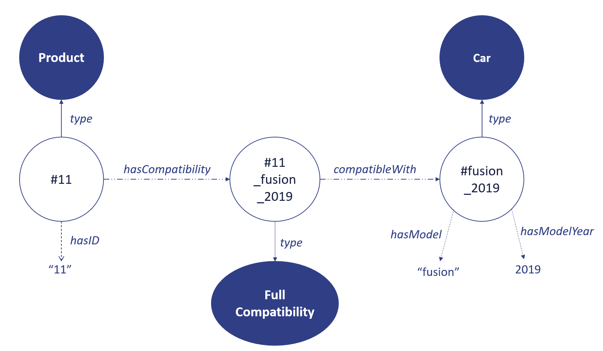

## Generating Knowledge Graphs from Unstructured Texts

In our paper we present a technique to generate triples encoding
compatibility relations between products and consumer items, by
extracting natural language entities and intents from Q&A pairs.
You can access the full text [here](http://ceur-ws.org/Vol-2722/nliwod2020-paper-3.pdf){:target="_blank"}.

Consider the question and answer pair about a product:
```yaml
ID: 11
Question:  Does this product fit in fusion 2019?
Answer:    Yes, it does.
```
This shows that a product, with ID *11*, is compatible with a car, *fusion 2019*. 
The presented algorithm generates the following graph:



## Quering Knowledge with SPARQL

To list all knowledge in an easy to read format:
```sparql
prefix onto:<gobots://research/2020/nliwod/knowledgebase/ontology#>

select ?id ?compatibility_type ?model ?year ?ans
where {
    ?product rdf:type onto:MLProduct;
             onto:hasSKU ?id;
             onto:hasCompatibility ?compatibility.
    ?compatibility rdf:type ?compatibility_type;
                   onto:attendantAnswer ?ans;
                   onto:compatibleWith ?car.
    ?car rdf:type onto:Car;
         onto:hasModel ?model;
         onto:hasModelYear ?year.
}
```
The result will look like the table:

| id   | compatibility_type                                                     | model     | year | ans                                    |
|------|------------------------------------------------------------------------|-----------|------|----------------------------------------|
| "01" | gobots://research/2020/nliwod/knowledgebase/ontology#FullCompatibility | "fusion"  | 2011 | "will fit perfectly"                   |
| "13" | gobots://research/2020/nliwod/knowledgebase/ontology#FullCompatibility | "corolla" | 2020 | "yes it does"                          |
| "42" | gobots://research/2020/nliwod/knowledgebase/ontology#FullCompatibility | "fiesta"  | 2015 | "the advertised product is compatible" |

To query for the answer of extracted compatibility between product 
ID **42** and the car **fiesta**, year **2015**:

```sparql
prefix onto:<gobots://research/2020/nliwod/knowledgebase/ontology#>

select ?compatibility_type ?ans
where {
    ?product rdf:type onto:MLProduct;
             onto:hasSKU "42";
             onto:hasCompatibility ?compatibility.
    ?compatibility rdf:type ?compatibility_type;
                   onto:attendantAnswer ?ans;
                   onto:compatibleWith ?car.
    ?car rdf:type onto:Car;
         onto:hasModel "fiesta";
         onto:hasModelYear 2015 .
}
```

## Sample of the Knowledge Graph

You can download the [Turtle document](https://raw.githubusercontent.com/rodrigocaus/ecommerce-kgqa/gh-pages/ttl/nliwod_2020_gobots.ttl){:target="_blank"} 
sampled from the generated KG referred to in the paper.

### Contact

Project maintained by [Diogo](https://github.com/diogoteles08) and [Rodrigo](https://github.com/rodrigocaus)

Powered by [GoBots](https://gobots.ai/){:target="_blank"}
